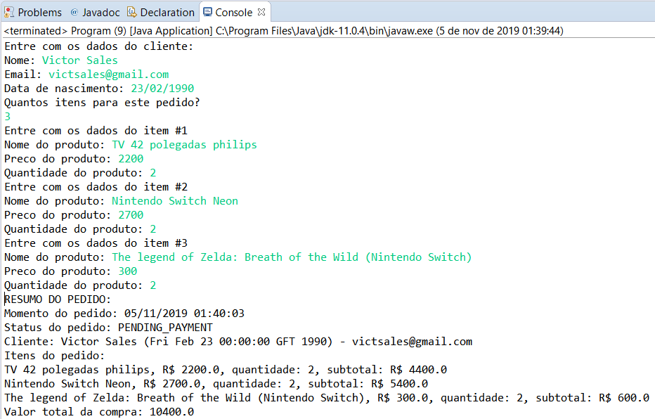
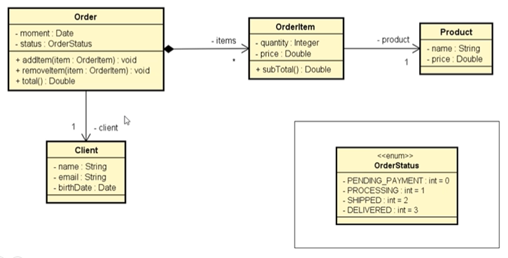

# curso-java-Post

Códigos do curso online de java avançado na Udemy(https://www.udemy.com/share/1013hwA0cfdVlTQn4=/)

Neste exercicio, foi utilizada a classe StringBuilder para concatenar as substrings do metodo toString da classe Order. Além da classe Order ter um atributo estatico, uma vez que o atributo possui sempre o mesmo valor, para nao ser necessario criar uma copia do valor para cada instancia, permanece um valor unico para todas as instancias da classe Post. Alem de ser mais um exemplo de composicao (conceito de POO) em Java e do uso de varios elementos da linguagem em si. 

O programa Le os dados do cliente, e os itens do pedido e retorna o resumo da compra. Este exercicio completa o capitulo de composicao (conceito de POO)

Se a descricao nao ficou clara, o programa executa de acordo com o print do console demonstrado a seguir:

As classes foram implementadas seguindo o seguinte diagrama de Classes:

